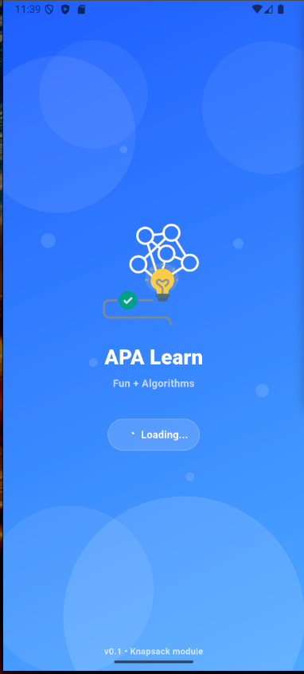
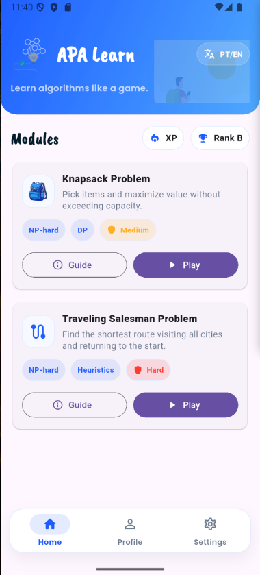
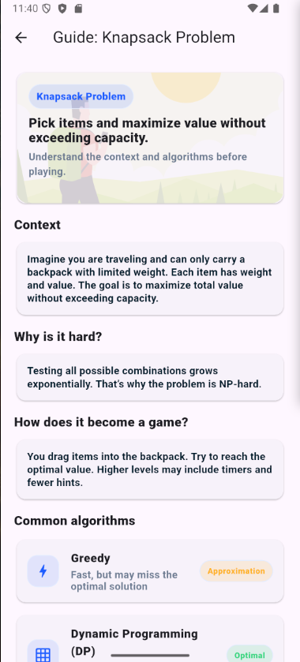
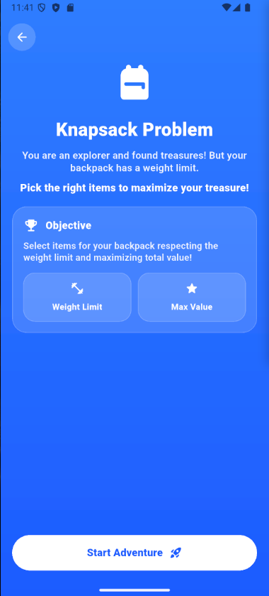
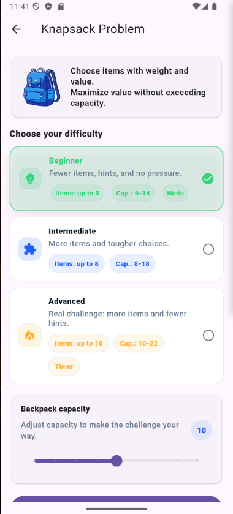
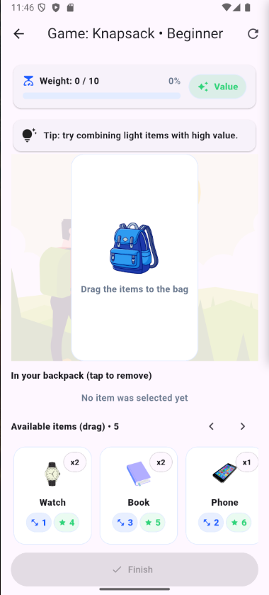
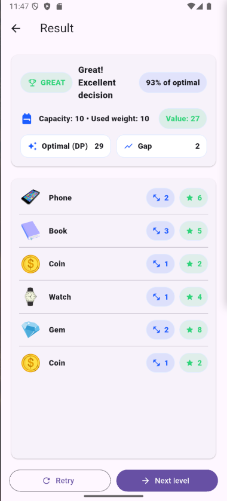

# APA Learn 📚🎮

**Learn Algorithms in a Fun and Interactive Way**

> APA Learn is a Flutter educational app designed to teach classic algorithmic problems (like Knapsack and TSP) through gameplay, visual feedback, and interactive challenges.

---

## 📸 Screenshots & Demo

### 🎥 Demo Video

Drive link:
https://drive.google.com/file/d/1LVvu8wJggGvWyrWdHBafLngYcESaFv6w/view?usp=drive_link


##  Screenshots

### 🎬 App Flow Preview

#### 🚀 Splash



#### 🏠 Home



#### 📘 Knapsack Guide (Educational Context)



#### 🎒 Knapsack Module Intro



#### Difficulty Seletion



#### 🎮 Gameplay (Drag & Drop + Capacity Logic)



#### 📊 Result & Feedback (DP Optimal + Suggestions)




# Compact layout:

```md
## 📸 Screenshots

| Splash | Home | Guide |
|-------|------|-------|
|  |  |  |

| Intro | Difficulty | Gameplay | Result |
|-------|------------|----------|--------|
|  |  |  |  |
```

---

## ✨ Features

### 🎮 Interactive Algorithm Learning

* Knapsack Problem (0/1)
* Traveling Salesman Problem (TSP) (intro + structure ready)
* Gamified learning experience
* Visual feedback and scoring system

---

### 🎒 Knapsack Module (Fully Implemented)

Includes complete learning flow:

* Guide Screen (context + algorithms)
* Boarding / Onboarding screen
* Difficulty selection (Beginner / Intermediate / Advanced)
* Adjustable backpack capacity
* Drag & drop item gameplay
* Dynamic DP optimal solution calculation
* Result grading system:

  * FAIL / OK / GREAT
  * % of optimal solution
  * Suggestions based on player choices
* Optimal solution viewer (DP)
* Hints system (beginner-friendly)
* Timer (advanced mode)

---

### 🧠 Educational Guide System

* Contextual explanation of the problem
* Algorithm accordion (expandable):

  * Greedy
  * Dynamic Programming (DP)
  * Brute Force / Backtracking
* Illustrated learning with custom assets

---

### 🌍 Internationalization (L10n)

* Full multilingual support using ARB
* Supported languages:

  * 🇧🇷 Portuguese (pt)
  * 🇺🇸 English (en)
* Language switch available in Settings
* Dynamic localization with `AppLocalizations`

---

### 🔊 Feedback & UX Enhancements

* Sound feedback (success / fail / great)
* Confetti particle effects (no external libs)
* Micro-animations and scroll hints
* Responsive UI using MediaQuery extensions
* Custom floating navigation bar
* Smooth page transitions (AnimatedSwitcher)

---

### 📦 Update System (Production Ready)

* Integrated with **Upgrader** (iOS + Android)
* Detects new versions from App Store / Play Store
* Update prompt shown automatically
* Version-aware UX

---

### ⚙️ Settings & Configuration

* Language selector (EN / PT)
* Native app version display (pubspec-based)
* Clean configuration UI
* L10n-ready settings screen

---

### 🧭 Navigation Architecture

Centralized routing system:

* Splash
* Shell (with UpgradeAlert)
* Home
* Settings
* Profile (future)
* Knapsack Flow:

  * Guide
  * Boarding
  * Intro
  * Play
  * Result
* TSP Flow (structure prepared)

---

### 🧱 Architecture Highlights

* Feature-based structure
* Separation of concerns (Controller / Data / Presentation)
* Reusable widgets
* Modular routing
* Localized difficulty models
* DP solver embedded in result engine

---

## 📂 Current Modules

### 🟢 Implemented

* Knapsack Guide
* Knapsack Boarding
* Knapsack Intro
* Knapsack Play (Game)
* Knapsack Result (DP + Grading)
* Home Screen
* Settings (Language + Version)
* Splash Screen (Animated)
* Shell Navigation (Floating NavBar + Upgrader)

### 🟡 In Progress

* TSP Intro
* TSP Gameplay
* TSP Result

### 🔮 Future Features

* 👤 Profile Screen (planned)
* Leaderboards / XP system
* More algorithm modules (Graph, Sorting, DP variants)
* Daily challenges
* Achievements system

---

## 🛠 Tech Stack

* Flutter (Material 3)
* Dart
* L10n (ARB + intl)
* Upgrader (store version detection)
* Custom animations (no heavy UI libs)
* Native version channel (Android/iOS)
* Clean architecture (feature modules)

---

## 🌐 Localization Setup

Uses:

```
lib/l10n/
 ├── app_en.arb
 ├── app_pt.arb
 └── app_localizations.dart
```

Supported locales:

* `pt`
* `en`

---

## 🚀 Getting Started

### 1. Clone the repository

```bash
git clone https://github.com/your-username/apa-learn.git
cd apa-learn
```

### 2. Install dependencies

```bash
flutter pub get
```

### 3. Run the app

```bash
flutter run
```

---

## 📱 App Versioning

The app reads version directly from:

```
pubspec.yaml → version: 1.0.0+1
```

Displayed natively inside Settings screen.

---

## 🧪 Development Notes

* No external sound libraries (custom feedback FX)
* No heavy animation frameworks
* Optimized for educational UX
* Fully responsive layout
* L10n-safe architecture (no hardcoded strings)

---

## 🎯 Educational Goal

APA Learn aims to make complex Computer Science topics like:

* NP-hard problems
* Dynamic Programming
* Optimization strategies

accessible through interactive and gamified experiences.

---

## 📄 License

This project is private / educational 

---

## 👨‍💻 Author

Michel Adelino (Neb Shefa)
Software Developer
Brazil 🇧🇷


